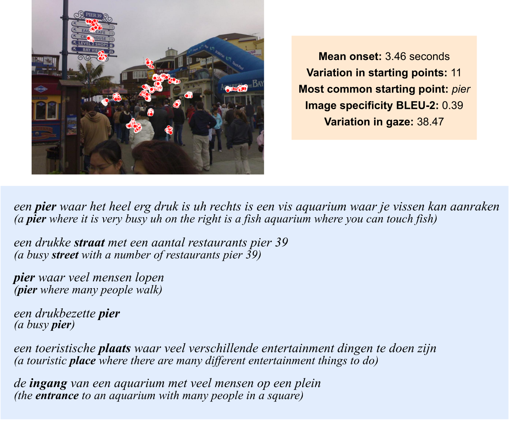

# Describing Images *Fast and Slow*: Quantifying and Predicting the Variation in Human Signals during Visuo-Linguistic Processes

Repository for the EACL 2024 paper 'Describing Images *Fast and Slow*: Quantifying and Predicting the Variation in Human Signals during Visuo-Linguistic Processes' by Ece Takmaz, Sandro Pezzelle, Raquel Fernández. [arXiv link](https://arxiv.org/abs/2402.01352)

For any questions regarding the contents of this repository, please contact Ece Takmaz at ece.takmaz@uva.nl (or e.k.takmaz@uu.nl).

**experiments** This directory includes the code to analyze the visuo-linguistic variation in descriptions and gaze as humans describe images. In addition, the code for the analysis of pretrained models in how much they capture human variation. 

**segment** includes utilizing the Segment Anything Model, giving eye movement data as prompts to segment image regions.

**whisperx** is used to extract the timestamps of each word uttered in the spoken descriptions (also provided in textual transcriptions).

**Google Drive** folder to download large files and folders: https://drive.google.com/drive/folders/1emci5ymaDi1rZcLVKCWmLLVYc7Y33aIj?usp=drive_link

Download the **DIDEC dataset** from https://didec.uvt.nl/pages/download.html (Emiel van Miltenburg, Ákos Kádár, Ruud Koolen, and Emiel Krahmer. 2018. DIDEC: The Dutch Image Description and Eye-tracking Corpus. In Proceedings of the 27th International Conference on Computational Linguistics (COLING), pages 3658–3669. Association for Computational Linguistics)

# Experiments / Analyses
How to preprocess the data and conduct the experiments 

# Segment
Install the Segment Anything Model (SAM) following the instructions at https://github.com/facebookresearch/segment-anything 

SAM takes in coordinates on an image as prompts, and then, predicts the object on which the coordinates fall. Afterwards, SAM outputs a mask corresponding to the object. In this work, I use gaze data as coordinate prompts.

I use the ‘sam_vit_l_0b3195.pth’ model (ViT-L SAM).

The scripts in this directory feed gaze data coming from each fixation into SAM, which yields object predictions for each fixation. I then use the bounding boxes of these predictions to calculate the variation in gaze. 

In the **images** directory, I provide the images from the DIDEC dataset (gaze coordinates correspond to images with gray borders as shown during data collection in the DIDEC paper; therefore, I offset the coordinates, skipping the borders). 

In the **didec** directory, you should place our file containing all preprocessed fixations per participant and per image (fixation_events_DS_2023.json). It can be downloaded from here: https://drive.google.com/file/d/1fa5-WMhEMqhzPLlCurAlpcYlDCgV0hhE/view?usp=drive_link

I divided the participants into 4 subsets and ran the extraction code in parallel for all participants. 

To extract the bounding boxes of predicted segments based on gaze data, run 

run_sam_prompt_didec_2023_BBOX_subset1.py

run_sam_prompt_didec_2023_BBOX_subset2.py

run_sam_prompt_didec_2023_BBOX_subset3.py

run_sam_prompt_didec_2023_BBOX_subset4.py

To obtain the image regions corresponding to the bounding boxes of predicted segments based on gaze data, run 

run_sam_prompt_didec_2023_subset1.py

run_sam_prompt_didec_2023_subset2.py

run_sam_prompt_didec_2023_subset3.py

run_sam_prompt_didec_2023_subset4.py

I provide the extracted bounding boxes here: 
https://drive.google.com/drive/folders/1tTO2yFIjhXqkQI7dVn5isgPNsjAELwmu?usp=drive_link

# WhisperX
Install WhisperX following the instructions at https://github.com/m-bain/whisperX

I use WhisperX to obtain the timestamps of the words uttered. Since the descriptions are in Dutch, I use the language_code ‘nl’, which loads the Dutch model ‘jonatasgrosman/wav2vec2-large-xlsr-53-dutch’. If you don’t specify the language_code, WhisperX can detect the language. Unfortunately, for some Dutch audio, it detects German. Therefore, I suggest specifying the language. 

You can download the contents of the folders as .zip archives from https://drive.google.com/drive/folders/1KKQpzvzviqIU56-O1BIblAv_47ejSzuQ?usp=drive_link 

I already provide the alignment files in the alignments_whisperX folder. However, if you would like to run WhisperX yourself, once you unzip the contents of these folders, you can run extract_whisperx_didec.py.

**grammars** includes the grammar files created in our previous project using the DIDEC data (https://aclanthology.org/2020.emnlp-main.377/). In the current project, we only use the sentences in these files, as they are the final clean versions of the transcriptions we preprocessed in the previous project. 

**converted_wavs** includes the audio descriptions in the wav format converted in the previous project to align with the CMUSphinx tool. We also feed these files into WhisperX. 

**alignments_whisperX** includes the results of audio-text alignment by WhisperX in the form of .json files. An example alignment is shown below for the audio file **Scan_Path_ppn105_713450.wav**

[{"text": "je", "start": 9.009023153753025, "end": 9.129143462469733}, {"text": "ziet", "start": 9.149163513922517, "end": 9.309323925544794}, {"text": "hier", "start": 9.329343976997578, "end": 9.509524440072639}, {"text": "vier", "start": 9.549564542978207, "end": 9.749765057506051}, {"text": "mensen", "start": 9.789805160411621, "end": 10.190206189467311}, {"text": "twee", "start": 10.250266343825665, "end": 10.430446806900726}, {"text": "daarvan", "start": 10.45046685835351, "end": 10.730747578692492}, {"text": "zitten", "start": 10.750767630145278, "end": 10.99100824757869}, {"text": "op", "start": 11.03104835048426, "end": 11.131148607748182}, {"text": "een", "start": 11.151168659200968, "end": 11.271288967917675}, {"text": "bankje", "start": 11.291309019370459, "end": 12.192211334745762}, {"text": "en", "start": 12.252271489104114, "end": 12.352371746368037}, {"text": "twee", "start": 12.392411849273607, "end": 12.612632415254236}, {"text": "staan", "start": 12.652672518159806, "end": 13.093113650121063}, {"text": "achter", "start": 13.153173804479417, "end": 13.47349462772397}, {"text": "hen", "start": 13.493514679176753, "end": 15.095118795399515}, {"text": "niemand", "start": 15.135158898305082, "end": 15.395419567191281}, {"text": "kijkt", "start": 15.43545967009685, "end": 15.635660184624696}, {"text": "in", "start": 15.65568023607748, "end": 15.735760441888617}, {"text": "de", "start": 15.755780493341403, "end": 15.83586069915254}, {"text": "camera", "start": 15.855880750605325, "end": 16.176201573849877}]

